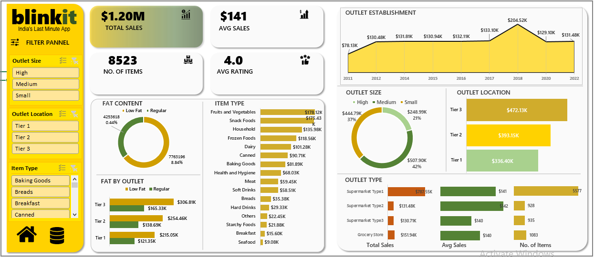
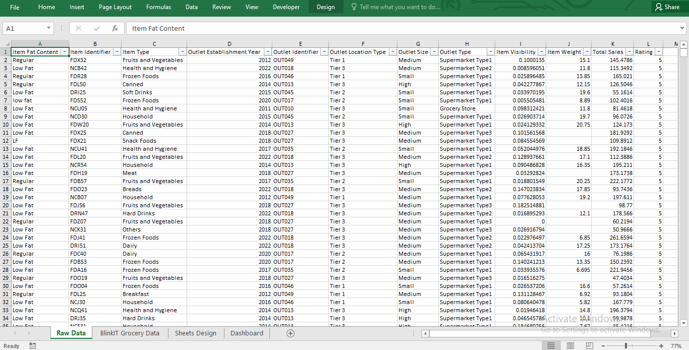

# Blinkit_Grocery_Sales_Dashboard
Interactive Excel dashboard for BlinkIT-style grocery sales data - includes KPIs, slicers, pivot charts, and insights by outlet type, size, location, and product mix.
# BlinkIT Grocery Sales – Excel Dashboard

An interactive Excel dashboard to analyze BlinkIT-style grocery sales.  
It highlights total/average sales, item mix, outlet performance by size, location, type, and fat content, with slicers for quick filtering.

## 🎯 Objectives
- Track overall sales KPIs (Total Sales, Avg Sales, Item Count, Avg Rating*).
- Compare performance by *Outlet Size, Location, Type*.
- Understand product mix by *Item Type* and *Fat Content*.
- Trend sales by *Outlet Establishment Year*.

\* Rating is an average/derived field if present in the dataset.

## 🧰 Tools & Skills
*Microsoft Excel 2016+* • Tables • Pivot Tables • Pivot Charts • Slicers • Custom Number Formats • Conditional Formatting • Data Cleaning (text standardization, missing values)  

## 📊 Key Features
- *KPI Cards:* Total Sales ($1.20M), Avg Sales ($141), Items (~8.5K), Avg Rating (~4.0).
- *Interactive Filter Panel:* Slicers for Outlet Size, Outlet Location, Item Type.
- *Visuals:*
  - Sales trend by Outlet Establishment Year (area/line).
  - Donut charts for Fat Content and Outlet Size distribution.
  - Bar charts for Item Type and Outlet Location sales.
  - Stacked bars for Fat by Outlet.
  - Outlet Type section: Total Sales, Avg Sales, and Number of Items side-by-side.
- *Design Sheet:* All pivot tables parked cleanly on a hidden/“Sheets Design” sheet and fed into the dashboard.

## 🗂 Data
Typical columns:
Item_Fat_Content, Item_Identifier, Item_Type, Outlet_Establishment_Year, Outlet_Identifier, Outlet_Location_Type, Outlet_Size, Outlet_Type, Item_Visibility, Item_Weight, Item_Outlet_Sales

> Source: educational dataset in the style of BigMart/BlinkIT retail data.

## 🧹 Data Cleaning (quick steps)
1. *Convert to Table:* Select data → Insert > Table → name it tbl_sales.
2. *Standardize text:*
   - Item_Fat_Content: map variations to Low Fat and Regular.  
     Example (helper column):  
     =IF(LEFT(LOWER([@Item_Fat_Content]))="l","Low Fat","Regular")
3. *Handle missing weights:* median imputation  
   =IF([@Item_Weight]="",MEDIAN([Item_Weight]),[@Item_Weight])
4. *Derive fields (optional):*
   - Outlet_Age = YEAR(TODAY()) - [@Outlet_Establishment_Year]
   - Ensure sales column is named Item_Outlet_Sales.

## 📈 Model / Pivot Setup
Create pivots on a *Sheets Design* sheet:

- *Sales by Outlet Size*  
  Rows: Outlet_Size | Values: Sum of Item_Outlet_Sales
- *Sales by Outlet Location*  
  Rows: Outlet_Location_Type | Values: Sum of Item_Outlet_Sales
- *All Metrics by Outlet Type*  
  Rows: Outlet_Type | Values:  
  Sum of Item_Outlet_Sales, Average of Item_Outlet_Sales, Count of Item_Identifier
- *Item Type Sales*  
  Rows: Item_Type | Values: Sum of Item_Outlet_Sales
- *Fat Content Split*  
  Rows: Item_Fat_Content (clean) | Values: Sum of Item_Outlet_Sales
- *Yearly Trend*  
  Rows: Outlet_Establishment_Year | Values: Sum of Item_Outlet_Sales

> *Custom sort for Outlet Type* (to show Supermarket Type1 → Type2 → Type3 → Grocery Store):  
> File > Options > Advanced > Edit Custom Lists → add  
> Supermarket Type1,Supermarket Type2,Supermarket Type3,Grocery Store  
> Then in the Pivot: *More Sort Options > More Options… > First key sort order: Custom Lists*.

## 🧩 Slicers & Interactivity
Insert slicers for Outlet_Size, Outlet_Location_Type, Item_Type.  
Right-click each slicer → *Report Connections* → tick all pivots.

## 🎨 KPI Cards & Formats
Create small pivots feeding into KPI cells. Apply custom currency with K/M:

## 📂 Project File
- [📊 Download Excel Dashboard](BlinkIT_Grocery_Data_Excel.xlsx)

## 📷 Screenshots

### Dashboard Overview 

### Data Overview

